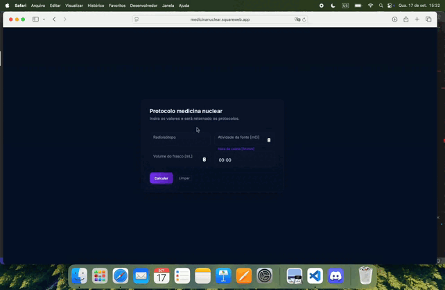
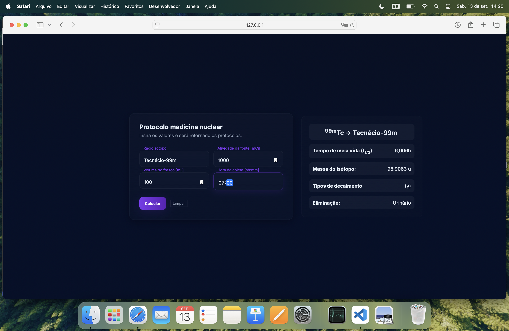
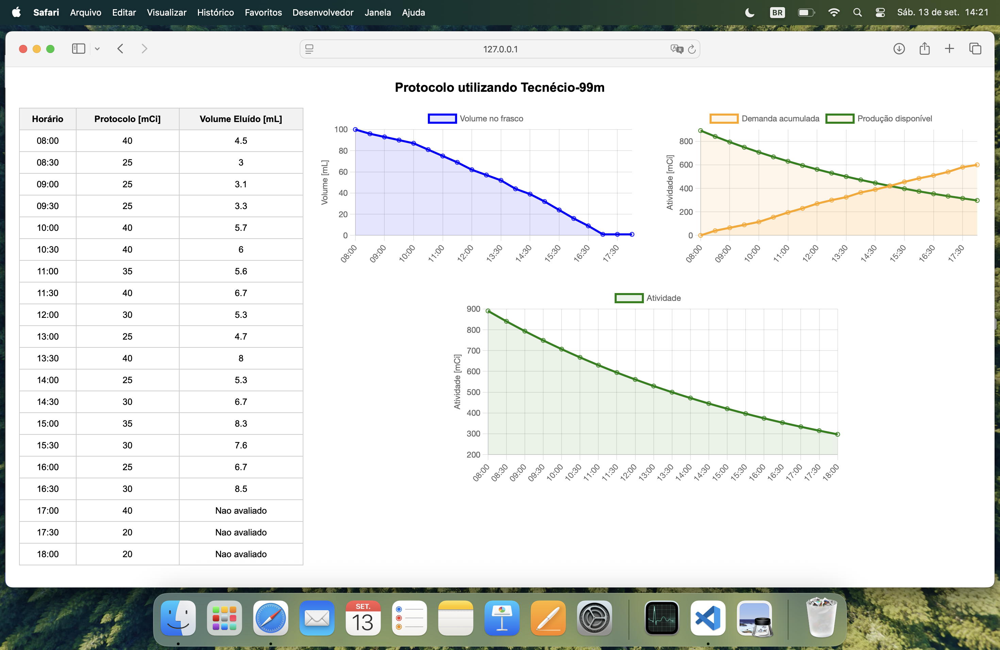

# 💊 Simulador de Protocolos radiofármacos - medicina nuclear

Aplicação web desenvolvida em **Flask** para simulação de protocolos de uso de radioisótopos
(Tecnécio-99m, Iodo-131 e Rubídio-82).  
O sistema calcula a atividade corrigida pela meia-vida, gera protocolos aleatórios e exibe os resultados em uma tabela de horários que
se iniciam às 08:00 até às 18:00 com pausa entre 12:00 e 13:00.

---

## 🚀 Como executar

1. Clone este repositório:

```bash
git clone https://github.com/Filho-exe/medicina-nuclear.git
cd medicina-nuclear
```

2. Crie um ambiente virtual e instale as dependências:

```bash
python -m venv venv
source venv/bin/activate   # Linux/Mac
venv\Scripts\activate    # Windows
pip install flask
```

3. Execute a aplicação:

```bash
python app.py
```

4. Acesse no navegador:

```
http://127.0.0.1:5000
```

---

## 📂 Estrutura do Projeto

```
.
├── static/
│   ├── css/
│   │   ├── main.css            # css stylesheet utilizado no formulário main.html
│   │   └── table.css           # css stylesheet utilizado no formulário table.html
│   ├── img/
│   │   └── ufg_favicon.png     # Logo UFG utilizada como favicon no navegador
│   ├── js/
│   │   ├── main.js             # Script utilizado no formulário main.html
│   │   └── table.js            # Script utilizado no formulário table.html
├── templates/          
│   ├── main.html               # Página inicial com formulário
│   └── table.html              # Exibição da tabela de protocolos
├── main.py                     # Código principal Flask
└── README.md                   # Este arquivo
```

---

## 📊 Funcionalidades

- Cálculo da atividade inicial corrigida pelo tempo até cada protocolo.
- Geração automática de protocolos aleatórios.
- Exibição de tabela com:
  - Horários de coleta (08:00 até 18:30, intervalos de 30 min)
  - Atividade em cada instante
  - Volume necessário
  - Volume final disponível
  - Relação demanda e oferta

---

## 🧪 Radioisótopos Suportados

- **Tecnécio-99m** → meia-vida: 6h (360 min)
- **Iodo-131** → meia-vida: 8 dias (11520 min)
- **Rubídio-82** → meia-vida: 1,25 min

---

## 🌐 Rotas

- `/` → Página inicial (`main.html`)
- `/table` → Página de tabela (`table.html`)
- `/search` → Processa os dados enviados pelo formulário e gera a simulação

---

## 📝 Exemplo de uso

1. Informe no formulário:
   - Radiofármaco desejado
   - Volume inicial (mL)
   - Atividade inicial (mCi)
   - Horário de eluição

2. Clique em **Calcular**.

3. O sistema irá gerar a tabela mostrando a disponibilidade do radiofármaco ao longo do dia.

4. Caso desejar, a aplicação está hospedada em https://medicinanuclear.squareweb.app até o dia 17/10/2025.

---

## 📷 Screenshot

> 
> 
> 
---

## 🛠️ Tecnologias Utilizadas

- Python 3.9.6
- Flask
- HTML + Jinja2 (para templates)

---

## 📜 Licença

Este projeto é de uso acadêmico/didático.
Sinta-se à vontade para modificar e adaptar conforme necessário.

